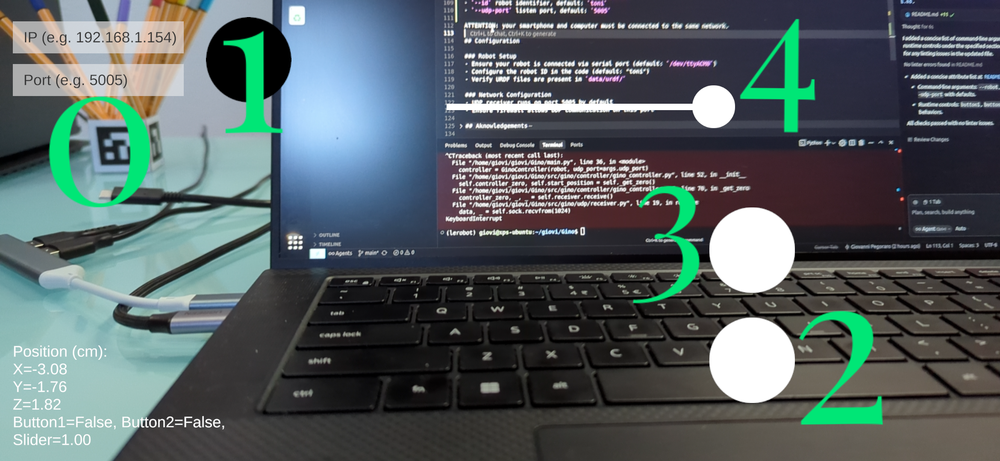

# Gino
## Leader free SO-100 teleop


A Python library to teleoperate SO-100(1) 5DoF robot arms without the need of a leader arm, using a smartphone as control device.

<p align="center">
  <a href="https://youtu.be/p6s8waqRF64">
    
  </a><br>
  <a href="https://youtu.be/p6s8waqRF64"><em>▶ Watch the demo video (YouTube)</em></a>
</p>

## ⚠️ IMPORTANT NOTE ⚠️
The day before releasing the repo I stumbled upon [this post](https://www.linkedin.com/feed/update/urn:li:activity:7374436299757264896/). About 30hrs before this repo went public Hugging Face released their own teleop software which works by the same principle, rendering this whole thing basically useless. I decided to publish this anyway since it was nearly finished and I had already put some effort into it. That said, if you're interested in this functionality, the native LeRobot option is recommended.


## How does it work


This is just if you have 5 minutes and are curious about how it works. It's not needed if you just want to use the library.


### Background


The library is made up of two main parts:
- motion tracking
- robot control


While the latter was more straightforward, the pose estimation went through some iterations.


- The original idea was to use an IMU, getting rotation from the gyroscope and translation from the accelerometer.


  PROBLEM: I wasn´t able to retrieve translation values from the accelerometer, no matter how I tried.


  NOTE: tried on 2 different sensors:
     - the LSM6DS3 from the Nintendo Switch (1) JoyCons
     - the LSM6DSOXTR from the Arduino Nano RP2040 Connect


- I then switched to ArUco markers which worked after implementing a simple sensor fusion algorithm to complement rotation values with the ones from a gyroscope, video [here](https://www.youtube.com/watch?v=MJFxeeDT9zo&list=PLoMn4XSmzQVu8NEgxb1Ril7S2hY5TnDDn&index=2).


  PROBLEM: in order to avoid motion blur (which capped the speed at which the controller could be used effectively) the ArUco cube needed to be backlit. I built a simple prototype PCB for that, but at that point the solution could not be easily replicated.


  NOTE: this version was likely the one that performed better from a smoothness/accuracy point of view.


- I finally settled on using AR APIs from Unity. Which is the current implementation. I implemented (read "ChatGPT implemented") a Unity AR app which sends absolute position and orientation values over Wi-Fi. The whole app is basically just made of an AR Foundation API call.


  NOTE: I didn´t even think such a thing was possible until I stumbled on [teleop](https://github.com/SpesRobotics/teleop) from Spes Robotics. Unfortunately their implementation relied on WebXR API, which is not supported on iOS. Since I wanted a cross-platform option*, after a bit of ChatGPTing, I settled on Unity.


### Project breakdown


Inside `main.py` a `GinoController` instance from `src/gino/controller/gino_controller.py` is created. Inside it:


- `Receiver` class from `src/gino/udp/receiver.py` is used to get and unpack the data sent over Wi-Fi from the smartphone*.


- `MoveRobot` class from `src/gino/kinematics/move_robot.py` is used to perform the inverse kinematics calculations needed to turn the 6D coordinates into arm joints states.


  - The class in turn relies on the `RobotKinematics` Pinocchio wrapper from `src/gino/kinematics/kinematics.py`. Credits for this and other related code go to Joe Clinton with his [hand_teleop](https://github.com/Joeclinton1/hand-teleop) repository, which turned out to be really important for this project.


#### ArUco (deprecated)
As said previously an earlier iteration of the project relied of ArUco markers for the pose estimation. The related code is no longer used by the library itself but I thought that someone could find it useful for other projects, hence left it here.


The related files are inside the `archive` branch. They're not well documented so feel free to ask in case of need.


## Installation


### 0. LeRobot installation


You should already have created the `lerobot` conda env and installed the LeRobot library inside it.


Be sure to have the env activated:
```bash
conda activate lerobot
```


### 1. Clone the Repository
```bash
git clone <repository-url>
cd Gino
```


### 2. Install Core Dependencies
```bash
conda install -c conda-forge numpy scipy matplotlib pyserial pinocchio
```

### App installation
The APK for the app can be found inside the `apk` folder*.


## Usage


### Robot Setup
- Ensure your robot is connected via serial port
- Ensure that your pc and smartphone are connected to the same network


### App setup



Start the app then:
- 0 Enter the ip of your computer and the desidered UDP port (default is `5005`)
- 1 Press the black button to confirm


Commands:
- 2 Homes the robot, restarts teleop when pressed again
- 3 Prevents the robot from moving when pressed
- 4 Slider to control the gripper


### Basic Teleoperation
If you just want to teleoperate your robot, run the following command:


```bash
python main.py
```


The following attributes are available:


- `--robot` (so100|so101), default: `so101`
- `--port` serial device, default: `/dev/ttyACM0`
- `--id` robot identifier, default: `toni`
- `--udp-port` listen port, default: `5005`


IMPORTANT: keep in mind that the reference point for position/orientation for the controller will be the point where the controller is located right when the initial homing phase ends. This can be later modified by using button #3.

### Dataset Collection

This feature was never implemented because the official version of a similar solution came to be before this was ready.


## Acknowledgements


As previously mentioned I would like to warmly thank:


- Joe Clinton for [hand_teleop](https://github.com/Joeclinton1/hand-teleop). Which provided a strong base for the development of the inverse kinematics algorithm.
- Spes Robotics for [teleop](https://github.com/SpesRobotics/teleop) which provided the idea behind the whole app.
- HuggingFace and TheRobotStudio for their awesome work on the [LeRobot](https://github.com/huggingface/lerobot) project.
- LAAS-CNRS for the [Pinocchio](https://stack-of-tasks.github.io/pinocchio/) library. Way too many times we think that research (especially public one) is confined inside labs and never finds applications in the real world. This library and all the amazing things I discovered people create with it demonstrate that it is not the case.


## License

This project is licensed under the terms specified in the LICENSE file.
